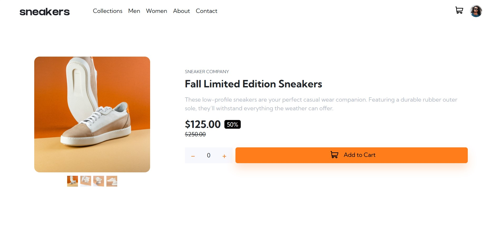
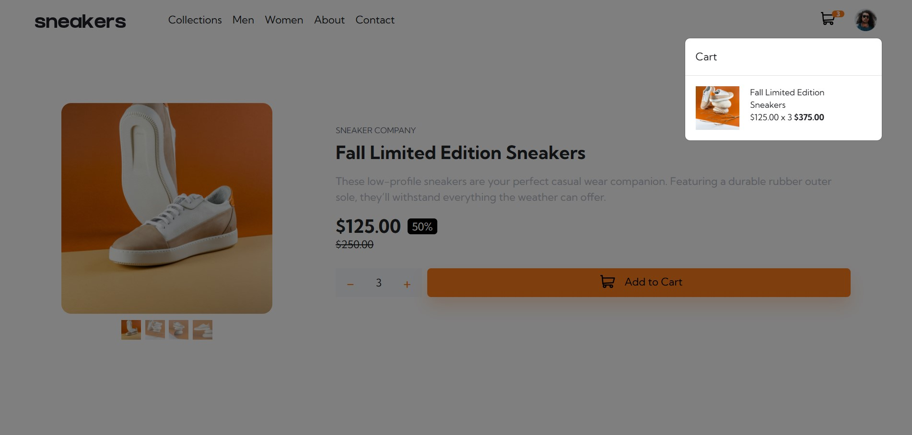
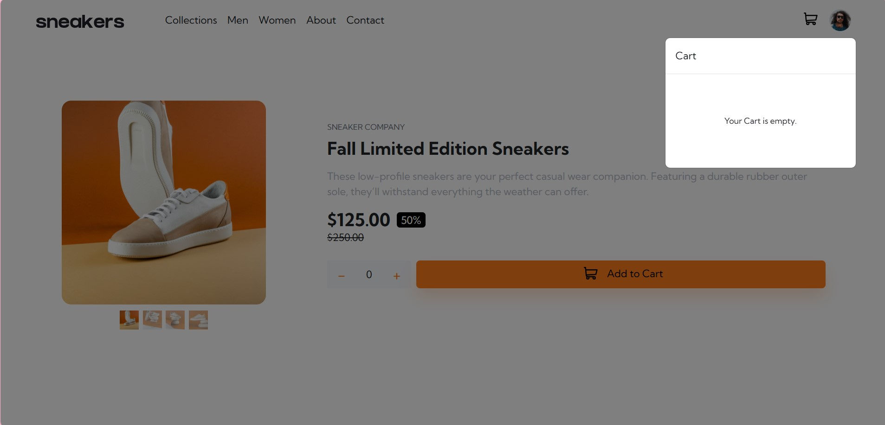
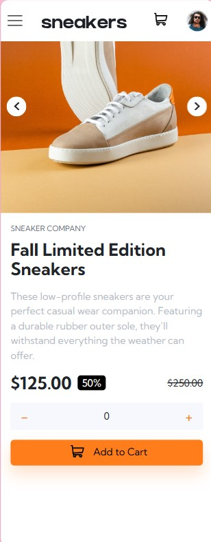
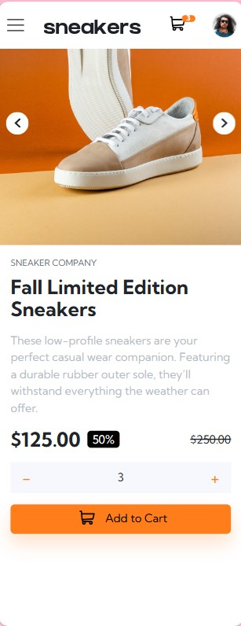
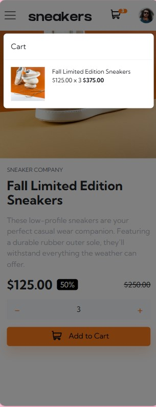
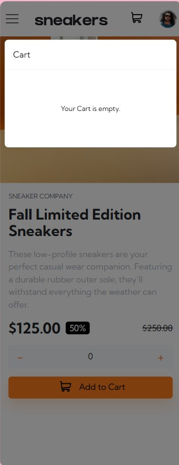

# Frontend Mentor - E-commerce product page

This is a solution to the [E-commerce product page challenge on Frontend Mentor](https://www.frontendmentor.io/challenges/ecommerce-product-page-UPsZ9MJp6). Frontend Mentor challenges help you improve your coding skills by building realistic projects. This project focuses on the HTML fundamental structures and the box model.

## Table of contents

- [Overview](#overview)
  - [Screenshot](#screenshot)
  - [Links](#links)
- [My process](#my-process)
  - [Built with](#built-with)

## Overview

### Screenshot

### Links

- Solution URL: [Git Hub Link](https://github.com/ajasmine94/product_page-bootstrap)
- Live Site URL: [Live Site Link](https://e-commercepage-bootstrap.netlify.app)

## My process

- Built the HTML structure
- Style with Bootstrap for responsive
- Lots of research

### Built with

- HTML
- Javascript
- CSS
- JQuery
- Bootstrap 5
